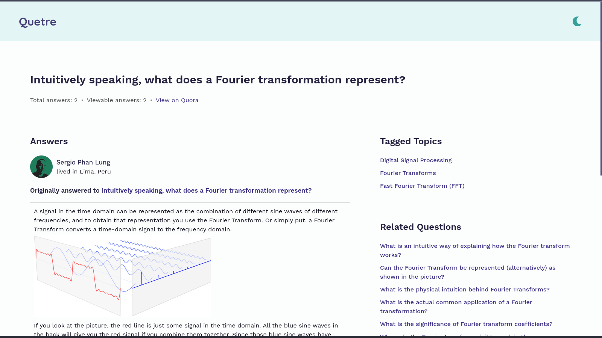
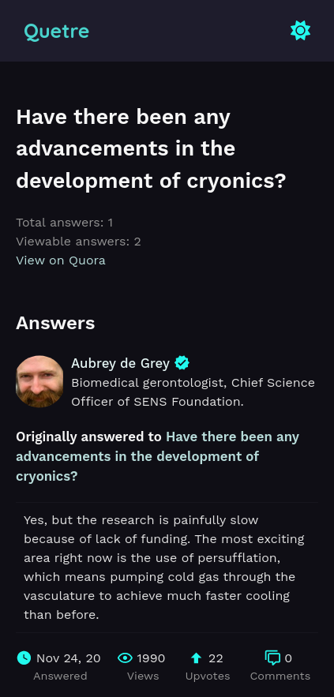

# **Quetre**

Quetre is an alternative front-end to Quora.
It enables you to see answers without ads, trackers, and other such bloat.

---

## **Key Features**

- Privacy focused

  All requests except for images are proxied which makes it impossible for Quora to collate meaningful data points about you.

- No ads or tracking

  Absolutely no ads, no tracking, no browser fingerprinting, and no telemetry of any kind.

- Fully responsive layout

  Utilises modern CSS features like CSS Grid and Flexbox to make the website fully responsive for all screen sizes.

- Lightweight and fast

  As the website contains no bloat, pages load in a jiffy and request sizes are tiny.

- Dark and light themes

  Whether you're a nightowl or bright screen lover, you'll enjoy curated color scheme for your taste.

- Unofficial API support

  just add `/api/v1/` after the domain name in the URL and get a JSON repsonse.

---

## **Screenshots**

|                                  |                                   |
| :------------------------------: | :-------------------------------: |
|  |  |

---

## **Instances**

| Instance URL                                            | Country | Provider | Notes                                                 |
| ------------------------------------------------------- | ------- | -------- | ----------------------------------------------------- |
| [quetre.herokuapp.com](https://quetre.herokuapp.com)    | Europe  | Heroku   | Official instance                                     |
| [quora.vern.cc](https://quora.vern.cc)                  | Canada  | OVHCloud | Operated by [~vern](https://vern.cc/)                 |
| [quetre.pussthecat.org](https://quetre.pussthecat.org/) | Germany | &ndash;  | Operated by [PussTheCat.org](https://pussthecat.org/) |

Centralisation is bad. Deploy your own instance if you can. It's easy and free with heroku.
Click the button below to get started:  
[](https://heroku.com/deploy?template=https://github.com/zyachel/quetre)

---

## **Comparision**

### Speed

URL for comparision: https://www.quora.com/How-does-the-Z-boson-decay
| | Quora | Quetre |
| :------------- | :---- | :------ |
| No. of requests | 83* | 15 |
| Load time | 6.76s | 4.61s |
| Finish time | 2.44min* | 4.62s |
| Data consumed | 3.49MB | 404.47KB |

\*the requests were ongoing even after 6 minutes

---

### Usability

- Quora: You can't even see an answer(unless you do some hacks) if you're not signed in. They put a big banner in front of answers to sign you up/in forcefully.

- Quetre: There is no accounts system. Just read whatever you want to read. Zero fuss.

---

### Privacy

#### Quora(when browsing anonymously)

From [their privacy policy](https://www.quora.com/about/privacy)

- Technologies used
  - cookies
  - log files
  - clear GIFs/pixel tags
  - JavaScript
  - web beacons
  - local storage objects
  - Analytics Tools
  - other tracking technologies
- Data collected
  - searches
  - page views
  - date and time of your visit
  - browser type
  - type of computer or mobile device
  - browser language
  - IP address
  - mobile carrier
  - unique device identifier
  - location
  - requested and referring URLs
  - other information about your use of the Quora Platform

#### Quetre

- Data actively collected by Quetre

  None.

- Data passively collected by Quetre

  Whenever you hit some error page, an error object is logged to the console on the server. That error object contains the resource url you were trying to access, and the usual stack trace. That's it.

- Data stored locally in your browser

  A key called 'theme' is stored in local storage provided by your browser to store your theme preference should you override the default theme. To prevent this behaviour, either disable JavaScript or local storage for Quetre.

- Data collected by other services

  Since Quetre is deployed on heroku, heroku might log your IP to prevent abuse. Also, as Quetre connects to '\*.quoracdn.net' and 'cdn.jsdelivr.net' for images and mathjax library respectively, both of these service might log some data. So, follow due precaution. Using a VPN might be a good idea. Or even better, consider hosting your own instance.

---

## FAQs

- There are some unreachable routes.

  I'm working to implement them soon. Keep an eye on [To-Do list](#to-do).

- Why is website connecting to '\*.quoracdn.net' and 'cdn.jsdelivr.net'?

  For the moment, images aren't proxied but directly fetched from quora. Hence the connection to quoracdn. As for the connection to jsdelivr, it is for an open source library – [Mathjax](https://www.mathjax.org/) – which is used to display math eqations nicely. If I get enough time, I'll include it locally.

- Why are some math equations showing up weirdly?

  If you're browsing with JavaScript disabled, then the Mathjax library isn't able to load and format tex equations. I'd recommend to enable JavaScript for it since there's no other way to show them in the browser. Even Quora uses Mathjax.

- Why can I only view a couple of answers?

  Quora doesn't show all answers at once. It only loads more answers as the user scrolls down. Furthermore, it uses many unique IDs to send ajax requests to fetch those answers. So, all in all, getting more answers isn't impossible but quite difficult requiring some serious amount of time on their website in order to figure out how it all happens. I'm short on time for now.

- I have some ideas/want to help.

  You're most welcome to do that. Just [contact me](#contact) or fork [the repo](https://github.com/zyachel/quetre/fork) and make a pull request. You can even help by correcting some typos or translating this README to other languages.

- Why the name Quetre?

  Quora is [supposedly](https://www.quora.com/Why-is-Quora-called-Quora-4) a portmanteau of 'Questions or answers'. In the same vein, Quetre is a portmanteau of 'Questions and answers', but [in Latin](https://lingva.ml/en/la/questions%20and%20answers%0A).

---

## To-Do

- [ ] add missing routes like topics, profile, and search
- [ ] use redis
- [ ] serve images and other assets from Quetre
- [x] implement a better installation method
- [ ] implement other trivial routes like a specific answer, spaces, etc.
- [ ] implement a way to get more answers(not a big priority as of now)

---

## Installation

### Manual

1. Install [Node.js](https://nodejs.org/en/) and [Git](https://git-scm.com/). Instructions are on their websites.

2. Clone and set up the repository.

   ```bash
   git clone https://github.com/zyachel/quetre.git
   cd quetre
   cp .env.example .env # you can make any changes here
   # change `pnpm` to `npm run` here as well as in package.json if you use `npm`
   pnpm install
   pnpm start
   ```

Quetre will start running at http://localhost:3000.

### Docker

There is a [docker image](https://github.com/PussTheCat-org/docker-quetre-quay) made by [@TheFrenchGhosty](https://github.com/TheFrenchGhosty) for [PussTheCat.org](https://pussthecat.org/)'s [instance](https://quetre.pussthecat.org/). You can check that out case you want to go the docker way.

---

## Misc

Check out these [projects](https://github.com/mendel5/alternative-front-ends) similar to Quetre.

---

## Contact

Send a message on [\[matrix\]](https://matrix.to/#/@ninal:matrix.org) or go old school with [email](mailto:aricla@protonmail.com) in case you wish to contact me.

---

## License

Licensed under [GNU AGPLv3](/LICENSE).
